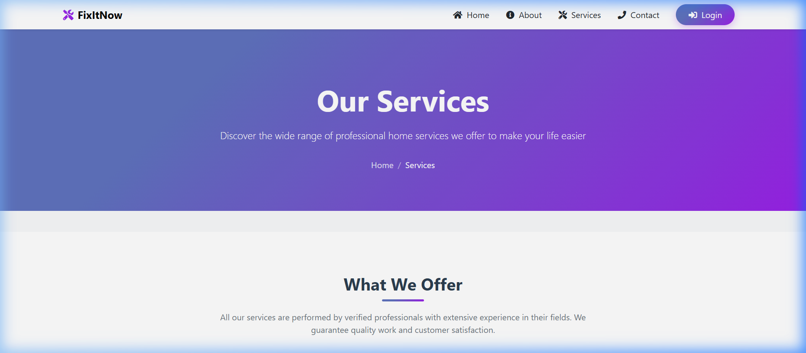
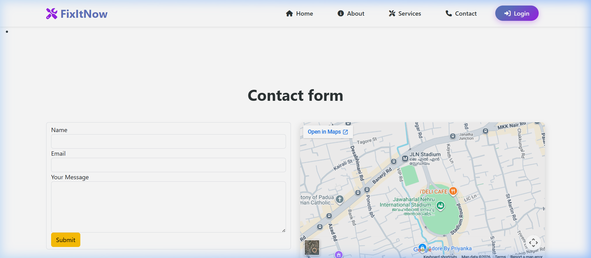

# FixItNow - Professional Home Service Providing Platform

[](https://fixitnow-home-service-providing-pla.vercel.app)
[](https://www.djangoproject.com/)
[](https://www.postgresql.org/)
[](https://razorpay.com/)

---

## Screenshots

### Home Page


### Services


### Contact Us


---

## Key Features

- **Dual Authentication**: Dedicated portals for both Customers and Service Professionals.
- - **Service Categories**: Browse categorized services like Cleaning, Plumbing, Electrical, etc.
  - - **Booking Management**: Real-time booking system with status tracking.
    - - **Secure Payments**: Integrated with Razorpay for safe and seamless transactions.
      - - **Reviews & Ratings**: Transparent feedback system to ensure high-quality service.
       
        - ---

        ## Tech Stack

        - **Backend**: Django (Python)
        - - **Frontend**: HTML, CSS, JavaScript (Bootstrap)
          - - **Database**: Neon (PostgreSQL) for Production
            - - **Deployment**: Vercel
              - - **Payments**: Razorpay API
               
                - ---

                ## Installation & Setup

                1. **Clone the repository:**
                2.    ```bash
                         git clone https://github.com/vishnucax/fixitnow-home-service-providing-platform.git
                         cd fixitnow-home-service-providing-platform
                         ```

                      2. **Install dependencies:**
                      3.    ```bash
                               pip install -r requirements.txt
                               ```

                            3. **Run Migrations:**
                            4.    ```bash
                                     python manage.py migrate
                                     ```

                                  4. **Start the server:**
                                  5.    ```bash
                                           python manage.py runserver
                                           ```

                                        ---

                                    ## License

                              MIT License
                        
